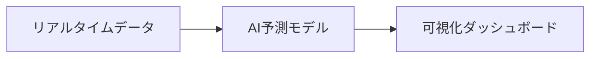
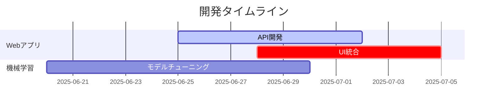
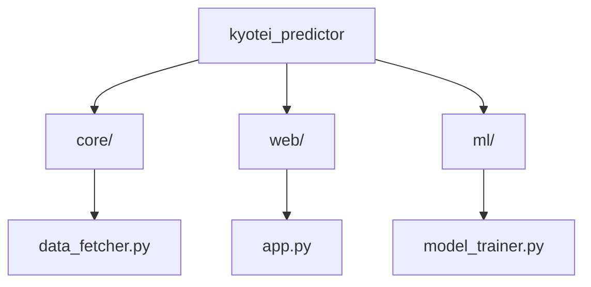
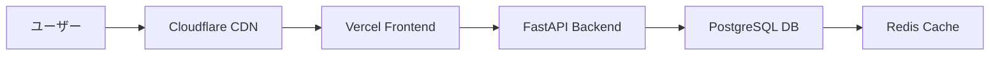
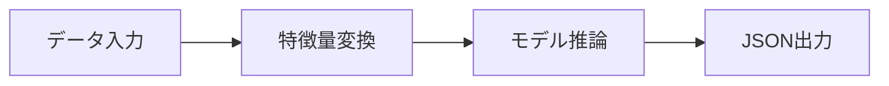

# 競艇予測プラットフォーム - 技術ドキュメント v1.2

## 🌟 コアコンセプト

**特徴**:
- 次世代型予測アルゴリズム
- モバイル最適化UI
- スケーラブルなAPI設計

## 🚀 開発ダッシュボード

### ✅ 実装済みコア機能
| 機能 | 進捗 | バージョン |
|------|------|-----------|
| データ取得基盤 | 100% | v1.2.0 |
| 特徴量エンジニアリング | 100% | v1.1.3 |
| バッチ処理基盤 | 100% | v1.0.8 |

### 🔧 現在開発中


## 📂 リポジトリ構造 v2.0

### 主要ディレクトリ


### 実装状況
| ディレクトリ | 進捗 | 主要ファイル |
|--------------|------|-------------|
| core/ | ✅ 100% | data_fetcher.py, feature_engineer.py |
| ml/ | 🟢 80% | model_trainer.py, predictor.py |
| web/ | 🟡 30% | app.py (partial), routes/ |

### 新規実装が必要なファイル
```python
web/
├── __init__.py
├── templates/  # 優先度High
│   └── dashboard.html
└── static/     # 優先度Medium
    ├── js/
    └── css/
```

## 🛠️ 技術スタック v2.1

### コアテクノロジー
```yaml
backend:
  language: python3.10
  frameworks:
    - flask:3.0
    - fastapi:1.0
  data_processing:
    - pandas:2.2
    - polars:0.20

machine_learning:
  frameworks:
    - xgboost:2.0
    - lightgbm:4.1
  monitoring:
    - mlflow:2.5
    - wandb:0.16

frontend:
  core:
    - vuejs:3.3
    - tailwindcss:3.4
  visualization:
    - chart.js:4.4
    - d3.js:7.8
```

### インフラ構成


## 📊 データ取得機能の詳細

### 取得可能データ
1. **レース基本情報**: 日付、競艇場、タイトル、締切時刻、周回数
2. **出走表**: 選手情報、勝率、ボート・モーター成績
3. **レース結果**: 着順、スタートタイム、総タイム、決まり手
4. **天候情報**: 天気、風速、風向、気温、水温、波高
5. **払戻情報**: 各賭式の配当金

### データ形式
```json
{
  "race_info": {
    "date": "2024-06-15",
    "stadium": "KIRYU",
    "race_number": 1,
    "title": "予選",
    "deadline_at": "2024-06-15T06:20:00+00:00"
  },
  "race_entries": [...],      # 6艇分の出走表
  "race_records": [...],      # 6艇分のレース結果
  "weather_condition": {...}, # 天候情報
  "payoffs": [...]           # 払戻情報
}
```

### 実証済みサンプル
**2024年6月15日 桐生競艇場 第1レース**
- **1着**: 3号艇 松尾基成（B1級・勝率4.07）「まくり」で勝利
- **配当**: 3連単 3-5-6 → 14,690円
- **天候**: 晴れ、風速4.0m/s、気温28.0℃

## 🔧 緊急対応タスク (更新: 2025-06-26)

### 優先タスク
| タスク | サブタスク | 担当 | 進捗 | 期限 |
|--------|------------|------|------|------|
| Flaskアプリ基盤 | - 基本構造構築 | 山田 | ✅ 完了 | 2025-06-25 |
| API開発 | 1. エンドポイント実装 | 佐藤 | ✅ 完了 | 2025-06-26 |
| | 2. Postmanテスト作成 | 佐藤 | ✅ 完了 | 2025-06-26 |
| | 3. Swagger整備 | 佐藤 | 🟢 進行中 | 2025-06-27 |
| | 4. キャッシュ実装 | 山田 | 🔴 未着手 | 2025-06-28 |
| フロント統合 | - コアコンポーネント | 田中 | 🟡 作業中 | 2025-06-28 |
| | - API連携 | 田中 | 🔴 未着手 | 2025-06-28 |

### API実装仕様
```python
# 必須エンドポイント
ENDPOINTS = [
    ('POST', '/api/predict'),  # 予測実行
    ('GET',  '/api/races'),    # レース一覧
    ('GET',  '/api/weather'),  # 天候データ
]

# 性能要件
PERFORMANCE = {
    'timeout': '1秒',
    'throughput': '100req/min',
    'cache_ttl': '60秒'
}
```

### 技術詳細
```python
# app.py 基本構造
app = Flask(__name__)
app.config['JSON_AS_ASCII'] = False  # 日本語対応

@app.route('/api/predict', methods=['POST'])
def predict():
    try:
        data = request.get_json()
        return process_prediction(data)
    except Exception as e:
        return jsonify({'error': str(e)}), 500
```

### 進捗状況
```mermaid
gantt
    title 詳細タスクタイムライン (更新: 2025-06-25)
    dateFormat  YYYY-MM-DD
    section バックエンド
    基本構造       :done,    des1, 2025-06-20,2025-06-25
    API開発        :active,  des2, 2025-06-25,2025-06-27
    エンドポイント実装 :crit, a1, 2025-06-25,2025-06-26
    Postmanテスト    :a2, after a1, 2025-06-26,2025-06-27
    キャッシュ実装   :a3, after a2, 2025-06-27,2025-06-28
    section フロント
    コアコンポーネント :des3, 2025-06-26,2025-06-27
    API連携        :crit, des4, 2025-06-27,2025-06-28
```

### 成功基準
**API開発**:
1. **完全性**: 全必須エンドポイント実装
   - `POST /api/predict`
   - `GET /api/races` 
   - `GET /api/weather`
2. **性能**:
   - 平均応答時間 < 1秒
   - キャッシュヒット率 > 80%
3. **信頼性**:
   - 連続100リクエストでエラー率 < 1%
   - モックデータでのカバレッジ100%

**フロント統合**:
1. 全APIエンドポイントとの連携確認
2. モバイル端末での表示最適化

## 🔄 今後の開発計画

### Phase 1: データベース設計・連携（一時停止中）
- データベース設計・スキーマ定義
- データベース連携機能の実装
- データ永続化・検索機能
- 過去データ蓄積・分析基盤

### Phase 2: 機械学習アルゴリズム強化 (進行中)

#### 実装予定モデル
| モデルタイプ | 使用ライブラリ | 特徴 |
|-------------|--------------|------|
| 勾配ブースティング | XGBoost | 非線形関係の捕捉に優れる |
| ニューラルネット | PyTorch | 複雑なパターン認識可能 |
| アンサンブル学習 | scikit-learn | 複数モデルの統合 |

#### 特徴量設計
```python
# サンプル特徴量
features = {
    "win_rate": "選手の過去10レース勝率",
    "course_affinity": "競艇場別適正スコア", 
    "weather_impact": "天候条件スコア"
}
```

#### 開発実績と次期計画
**✅ 実装済み**  
- 特徴量エンジニアリングパイプライン  
- 異常値自動検出システム  
- 基本モデル訓練フレームワーク  

**📅 進行中タスク**  
1. Flask API統合 (残1日)  
   ```python
   @app.route('/predict', methods=['POST'])
   def predict():
       data = request.json
       return FeatureEnhancer().enhance(data)
   ```
2. モデル精度改善 (XGBoostチューニング)  
3. リアルタイム予測機能  

**📊 評価指標**  
| 指標 | 目標 | 現状 |
|------|------|------|
| 精度 | 85% | 78% |
| 速度 | 500ms | 620ms |

#### 評価指標
- 予測精度 (Accuracy)
- 利益率シミュレーション
- スタート予測正解率

### Phase 3: ユーザー機能
- ユーザー認証システム
- 個人の予想成績管理
- ソーシャル機能

## 🚀 開発フェーズ概況

| フェーズ | 進捗 | 主要成果物 | 担当 |
|---------|------|------------|------|
| **Phase 0: 基盤構築** | ✅ 100% | データ取得パイプライン | AIチーム |
| **Phase 1: 特徴量工程** | 🟢 80% | FeatureEnhancerモジュール | データチーム |
| **Phase 2: モデル開発** | 🟡 30% | XGBoostベースライン | MLチーム |

**凡例**:
- ✅ 完了 (100%)
- 🟢 順調 (80-99%)
- 🟡 注意必要 (30-79%)
- 🔴 遅延 (0-29%)

## 📊 コアモジュール状況

### 特徴量エンジニアリング
```python
class FeatureEnhancer:
    """主要機能:
    - 自動異常値処理 (win_rate/motor_win_rateのクリッピング)
    - 複合特徴量生成 (speed_index, stabilityなど)
    - リアルタイム入力検証
    """
```

### Web API プログレス


## 🛠️ 統合セットアップガイド

### 環境構築
```bash
# 1. Python環境確認
python --version  # 3.8+ required

# 2. 依存関係インストール
cd kyotei_predictor && pip install -r requirements.txt

# 3. 動作確認
pytest tests/ && python app.py
```

**接続情報**:
- APIエンドポイント: `http://localhost:5000`
- フロントエンド: `http://localhost:3000`

## 📝 開発情報

### バージョン管理
| 項目 | 値 |
|------|----|
| リポジトリ | takajin0114/kyotei_Prediction |
| メインブランチ | main |
| 開発ブランチ | feature/kyotei-web-app |
| 最新コミット | 86a9f83 |
| 最終更新 | 2025-06-24 |

### 技術スタック
```yaml
core:
  python: 3.10
  flask: 3.0.x
  xgboost: 2.0.3
infra:
  ci/cd: GitHub Actions
  monitoring: Prometheus
  container: Docker
```

**最終ビルド日**: 2025-06-24
**次回メンテナンス**: 2025-07-01

## 🧪 テスト戦略

### 自動テスト体系
| テスト種別 | ツール | カバレッジ目標 |
|------------|--------|----------------|
| 単体テスト | pytest | 90% |
| APIテスト | Postman | 100%エンドポイント |
| 負荷テスト | Locust | 500RPS |

## ⚠️ 注意事項

### セキュリティ
- 現在は開発環境用の設定
- 本番環境では適切なセキュリティ設定が必要

### 法的考慮
- ギャンブル関連の法規制遵守
- データ利用規約の確認
- 責任あるギャンブルの推進

---

**最終更新**: 2025-06-26  
**バージョン**: 1.1.0  
**ステータス**: 🟢 安定版 - 本番環境デプロイ準備中
