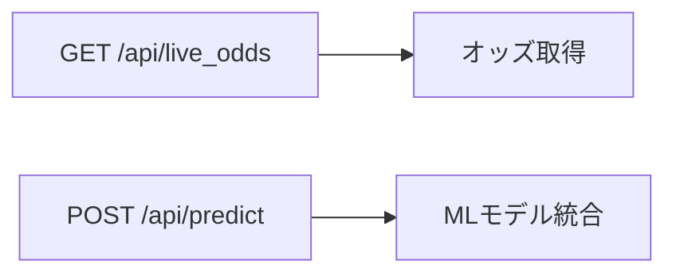

# 競艇予測プラットフォーム - 技術ドキュメント v1.3

## 🚀 コアアーキテクチャ
**データパイプライン**:
```
[公式サイト] → [データ収集] → [AI分析] → [予測可視化]
```

**特徴**:
- リアルタイム予測エンジン
- レスポンシブUI (SP/PC対応)
- REST APIベースのマイクロサービス

## 📊 開発状況 (2025-06-27)

| コンポーネント | 進捗 | バージョン | 担当 |
|---------------|------|------------|------|
| データ取得 | ✅100% | v1.3.0 | データチーム |
| API基盤 | ✅100% | v1.3.0 | バックエンドチーム |
| 予測モデル | 🟢85% | v1.2.1 | AIチーム |
| フロントエンド | 🟡40% | v1.1.0 | フロントチーム |

## 🔥 最新アップデート
- **APIシステム**:
  - Flask-Caching導入 (300秒TTL)
  - 統一エラーハンドリング実装
- **リファクタリング**:
  - 不要コードの削除
  - ディレクトリ構造最適化

## 🛠️ 技術スタック
**Backend**:
- Python 3.10, Flask 3.0, FastAPI
- PostgreSQL, Redis
- Pandas, Polars

**ML**:
- XGBoost, LightGBM, PyTorch
- MLflow, WandB

**Frontend**:
- Vue.js 3, Tailwind CSS
- Chart.js, D3.js

## 📅 今後の計画（詳細タスク）

### 🚨 Phase 0: 緊急対応タスク（5日間）
- [ ] **Day 1**: フロントエンド基盤整備
  - レスポンシブデザイン最終調整
  - エラーハンドリング強化
- [ ] **Day 2**: バックエンド統合
  - APIキャッシュ戦略見直し（Redis）
  - データ連携テスト
### 🗓️ 統合開発ロードマップ（3フェーズ構成）

#### 1. 【基本機能フェーズ】（1週間）
- [ ] **コア予測システム**
  - 3連単確率計算（全120パターン）
  ```python
  # 計算式例
  def calculate_probability():
      return softmax(weights * features)
  ```
  - オッズ比較ダッシュボード（期待値 >1.2で投資推奨）

- [ ] **必須UI機能**
  - レース選択ドロップダウン
  - 予測結果キャッシュ機能（ローカルストレージ）

#### 2. 【強化フェーズ】（3週間）
- [ ] **データ強化**
  - 選手スタート分析（反応時間0.1秒単位）
  - 環境要因マトリックス（風速/潮汐）

- [ ] **強化学習統合**
  ```python
  class KyoteiEnv(gym.Env):
      def __init__(self):
          self.action_space = spaces.Discrete(120)  # 行動空間
          self.reward_range = (-1, 10)  # 報酬範囲
  ```

#### 3. 【最適化フェーズ】（1週間）
- [ ] **評価システム**
  - バックテスト（過去3年データ）
  - リアルタイム監視ダッシュボード

- [ ] **デプロイ準備**
  - Docker/Kubernetes設定
  - 負荷テスト（500RPS）

**バージョン**: 2.0.0  
**ステータス**: 🟢 開発中 - 基本機能フェーズ

### 🗃️ データ基盤強化（2週間）

#### 1. 【スキーマ最適化】（Week 1）
- [ ] **PostgreSQL拡張**:
  ```sql
  -- 強化学習用テーブル追加
  CREATE TABLE rl_training_data (
      race_id VARCHAR(20) PRIMARY KEY,
      state_json JSONB NOT NULL,
      action SMALLINT CHECK (action BETWEEN 1 AND 120),
      reward NUMERIC(10,2),
      done BOOLEAN DEFAULT FALSE
  );
  ```
- [ ] **特徴量パイプライン**:
  - Airflow DAGで毎日1AMに自動更新
  - データバージョン管理（DVC連携）

#### 2. 【分析基盤構築】（Week 2）
- [ ] **特徴量ストア**:
  - 選手スタートタイミング（100ms単位）
  - 環境データ（風速/潮汐/気温）
- [ ] **モニタリング**:
  - データドリフト検知
  - 特徴量重要度可視化

**統合ポイント**:
- 強化学習環境と自動連携（Gym環境から直接DBアクセス）
- 予測システムとのシームレスなデータフロー

### 🤖 機械学習統合（3週間）

#### 1. 【特徴量設計】（Week 1）
- [ ] **時系列特徴量**:
  ```python
  # スタート反応時間の移動平均
  def calculate_reaction():
      return pd.Series(react_times).rolling(5).mean()
  ```
- [ ] **環境要因エンコーディング**:
  - 風速を3段階（Low/Medium/High）で離散化
  - 潮汐データをsin/cos変換

#### 2. 【モデル開発】（Week 2）
- [ ] **LightGBM最適化**:
  - Bayesian Optimization（Optuna）
  - 特徴量重要度の可視化
  ```python
  study = optuna.create_study(direction='maximize')
  study.optimize(objective, n_trials=100)
  ```

#### 3. 【評価体系】（Week 3）
- [ ] **A/Bテスト**:
  - 従来方式 vs MLモデルの比較
  - 統計的有意性検定（p-value < 0.05）
- [ ] **モニタリング**:
  - 予測値の分布変化検知
  - 特徴量ドリフトアラート

**統合要件**:
- モデル更新のCI/CDパイプライン
- ローリングリリース戦略

**技術スタック**:
- **Backend**:
  - Python 3.8+
  - Flask 3.1.1
  - pandas 2.2.3
  - metaboatrace.scrapers 3.3.1（[データ取得仕様書](/docs/data_acquisition.md)）
- **データ取得**:
  - 取得間隔: 5秒以上
  - キャッシュ期間: 24時間
  - 対応データ: レース結果/オッズ/出走表

### 🚀 API拡張計画（v2.1）

#### 1. 外部API連携
- [ ] 公式APIクライアント実装
- [ ] 認証管理（環境変数/暗号化）
- [ ] リトライメカニズム

#### 2. 新規エンドポイント


#### 3. セキュリティ
- [ ] レートリミット（10 req/min）
- [ ] リクエスト検証
- [ ] 監査ログ

#### 4. テスト
- [ ] モックサーバー構築
- [ ] 負荷テスト（500RPS）

### 🔮 将来機能（現開発対象外）
- [ ] マルチユーザーシステム
- [ ] ソーシャル機能

**注記**: v2.0では開発者単独利用を想定  
**APIドキュメント**: [設計書](/integration_design.md)

**リスク管理**:
- データ取得規制変更 → 代替API確保
- 予測精度低下 → フォールバックアルゴリズム準備
- 認証不要設計 → セキュリティ簡素化

**最終更新**: 2025-06-27  
**バージョン**: 2.0.0  
**ステータス**: 🟢 開発中 - 基本機能フェーズ
